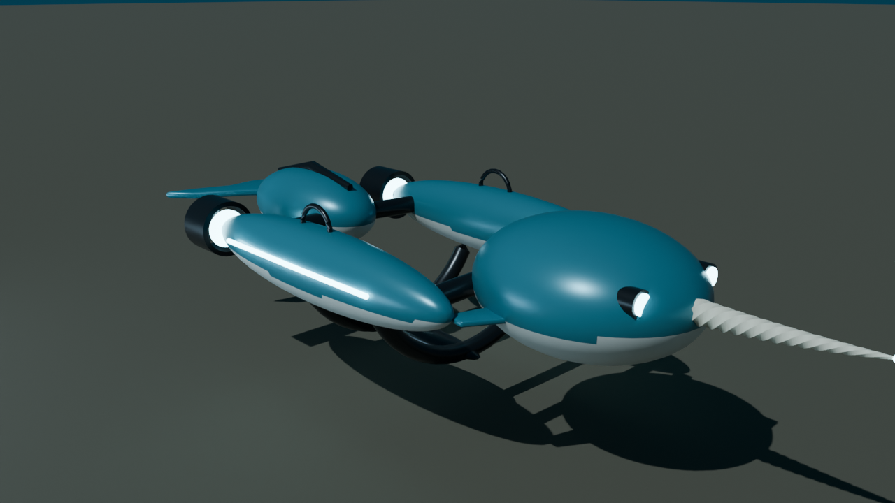
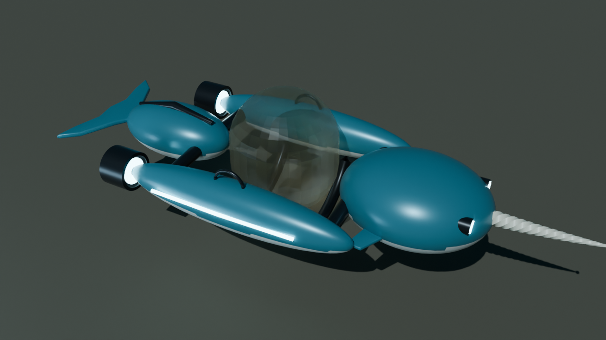
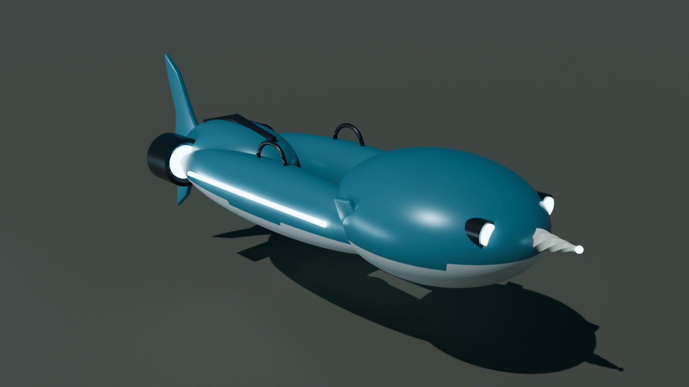
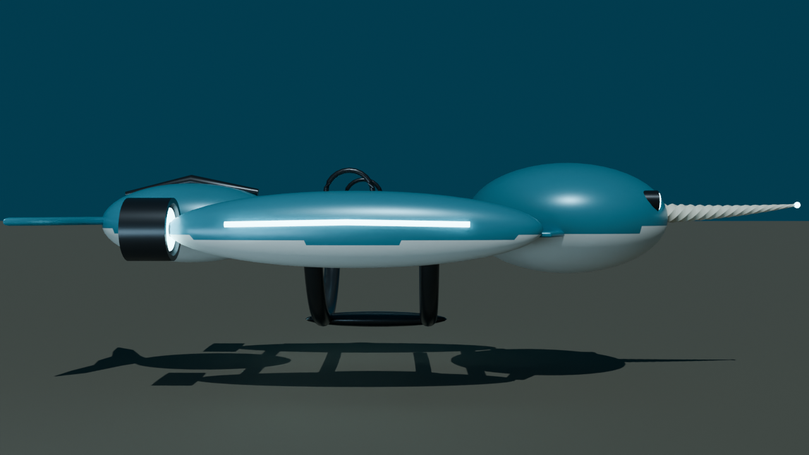
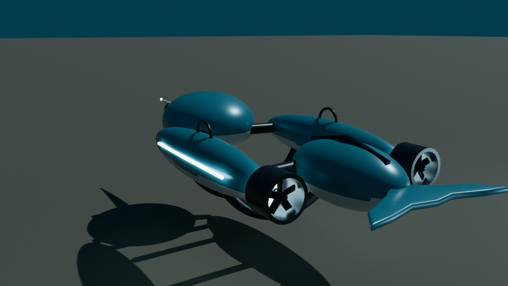

# Narwhal Chassis for Subnautica 2

A new submarine body for the Tadpole, modelled in Blender. The Narwhal is a whale-shaped shell that the Tadpole docks into. It has a long spiral sensor tusk with a glowing tip, headlights, two pontoons with ducted propellers and running lights, whale flukes, and a pale whale belly. When it's being carried it folds up: the flukes stand upright, the pontoons tuck in and the tusk pulls back into the head.



| With the Tadpole aboard (orange stand-in) | Folded for carrying |
| --- | --- |
|  |  |
|  |  |

Subnautica 2 already swaps bodies on the Tadpole: the Seafrog, the Scout Ray and the Haul are all *chassis* the pod docks into (`UWEVehicleChassis` in the game's code). The Narwhal plugs into that same system as a fourth chassis. It keeps all of the game's own docking, driving, power and damage behaviour, and only brings a new body, collision and handling.

## Status: what's done and what you still do

The **Blender part is finished.** You can open the model, tweak it and export it again, and the exports are ready for Unreal.

A Subnautica 2 vehicle has to be cooked into the game's IoStore format inside Unreal Engine. The only way to do that is the community modkit in the Unreal Editor, on Windows. I couldn't run the editor or the game here. So the **Unreal half is set up for you but not yet tried**: there's a ready-made plugin folder and an editor script that does most of the work. The handful of clicks that Unreal can't script are listed below.

| Part | State |
| --- | --- |
| Blender model, collapsed variant, collision, materials, UVs | Done; generated by `blender/build_narwhal.py` |
| FBX exports, Unreal axes and scale | Done; re-imported and checked |
| Fits around the Tadpole without clipping | Checked by the build script against the Tadpole's real collision capsule (80 cm radius, 96 cm half-height). It keeps 4 cm of clearance. |
| Unreal plugin (`NarwhalChassis/`) | Descriptor, config and icon done; assets get made in the editor |
| Editor setup script (`unreal/narwhal_setup.py`) | Written against the game's class data; not run yet |
| Packaged mod you can drop into the game | You make it with Alpakit's **Cook & Install** (below) |

## What's in here

```
blender/build_narwhal.py   builds the whole model from scratch
blender/Narwhal.blend      the result, to open and edit by hand
export/                    FBX files for Unreal, plus Narwhal.glb for any 3D viewer
previews/                  renders
NarwhalChassis/            the Unreal content-only plugin (the mod itself)
unreal/narwhal_setup.py    an editor script that imports and wires up the assets
```

### The model

- **SM_Narwhal_Chassis**: the deployed chassis, about 7.9 m long including the tusk, 3 m wide and 1.7 m tall, with around 16,800 triangles. The tusk is a six-sided horn twisted 2½ turns.
- **SM_Narwhal_Chassis_Collapsed**: the folded version, 6 m long and 1.8 m wide.
- **Collision**: five convex `UCX_` hulls inside the deployed FBX (two pontoons, the head and tusk, the tail, the keel) and two in the collapsed one. Unreal uses these automatically. They're also exported as standalone meshes, because the chassis class has its own `DeployedCollision` and `CollapsedCollision` slots.
- **Five material slots**: `M_Narwhal_Hull` (deep teal), `M_Narwhal_Belly` (pale white), `M_Narwhal_Trim` (gunmetal), `M_Narwhal_Tusk` (ivory) and `M_Narwhal_Glow` (cyan, emissive). UV channel 0 is unwrapped for texturing, and channel 1 is for lightmaps.
- **Axes and scale**: 1 Blender unit = 1 m = 100 Unreal units. The nose points along +X, up is +Z, and the origin is the centre of the cradle where the Tadpole sits.

### Changing the model

Open `blender/Narwhal.blend` and edit it by hand. Or change the numbers in `build_narwhal.py` and run it again. Every part (pontoons, head, tusk, flukes, ducts, lights, handles) is a short, labelled block in `build_narwhal()`.

```
blender --background --python blender/build_narwhal.py              # model, exports and renders
blender --background --python blender/build_narwhal.py -- --no-render
```

It works with Blender 4.2 and later; I built it with Blender 5.0.1. If an edit pushes anything into the Tadpole's space, the script stops with an error.

## Making it a mod in Unreal

You need Subnautica 2, Windows, and the [unofficial Subnautica 2 modkit](https://github.com/Subnautica2Modding/Subnautica2-Project) set up as its README describes. That includes the custom UE 5.6 engine, `GameInstallDirectory.txt` and the FMOD step.

1. **Add the plugin.** Copy the `NarwhalChassis` folder into the modkit's `Plugins` folder. Copy `export` and `unreal` alongside it too, keeping them next to each other, because the script finds the FBX files at `../export`. Open the project.
2. **Run the setup script.** Choose *Tools → Execute Python Script…* and pick `unreal/narwhal_setup.py`. It:
   - imports the four FBX files into `NarwhalChassis/Meshes`, with their collision
   - creates `BP_Narwhal_TadpoleChassis` as a child of the game's `BP_ScoutRay_TadpoleChassis`, and sets its deployed and collapsed collision
   - copies the Scout Ray's chassis data, item type, recipe and construct data into `NarwhalChassis/Data` under Narwhal names
   - gives the Narwhal its own handling: 20% more acceleration, 15% quicker turning, and more banking into turns

   Check the Output Log for lines starting with `[Narwhal]`. Each step logs what it did, or warns you if it couldn't.

### Finishing in the editor

These steps change inherited components and references inside cooked game assets, which the editor's Python can't do reliably:

3. **Swap the body.** Open `BP_Narwhal_TadpoleChassis`. In its component list, select the inherited Scout Ray mesh components and untick *Visible*. Then add two Static Mesh components: put `SM_Narwhal_Chassis` on the one under the deployed component, and `SM_Narwhal_Chassis_Collapsed` on the one under the collapsed component. Leave both at location 0,0,0. Compile and save.
4. **Re-link the copied data.** The copies still point at Scout Ray assets. Right-click each Narwhal asset and choose *Reference Viewer* to see the links, then open it and point those fields at the Narwhal versions:
   - `DA_Narwhal_ItemType`: give it a name and description, and set the actor or construct data it makes to `BP_Narwhal_TadpoleChassis` / `DA_NarwhalChassis_ConstructData`
   - `DA_NarwhalChassis_ConstructData`: set it to build `BP_Narwhal_TadpoleChassis`
   - `DA_Tadpole_Narwhal_Chassis_Recipe`: set the output to `DA_Narwhal_ItemType`, and choose the ingredients
   - wherever the Scout Ray blueprint references `DA_ScoutRay_TadpoleChassis`, use `DA_Narwhal_TadpoleChassis` in the Narwhal blueprint instead
   - optional: give the materials real textures, or make them instances of the Tadpole's own hull material so it matches the game's look
5. **Package it.** Click the **Alpakit** toolbar button, tick `NarwhalChassis` and click **Cook & Install**. Alpakit puts the mod in `<game>/Subnautica 2/Mods/`. The game scans the new item, recipe and chassis in by itself when it starts, so you don't need UE4SS.

Copying the Scout Ray's assets means the Narwhal unlocks and builds the same way the Scout Ray does. If you want it to unlock differently, change the recipe's requirements in step 4.

If you share it, credit the modkit, as its author asks: *Created using the Unofficial Subnautica 2 modkit https://github.com/Subnautica2Modding/Subnautica2-Project/*

## Where the game details come from

The asset paths and class names (`BP_ScoutRay_TadpoleChassis`, `UWEVehicleChassis.DeployedCollision` and `CollapsedCollision`, `UWEVehicleChassisData` handling fields, the Tadpole's 80 × 96 cm capsule) come from the modkit's reflection dump of game build CL-128456 and its asset registry. Subnautica 2 is in Early Access, so a later update could rename some of them. The setup script warns you instead of failing when that happens.
