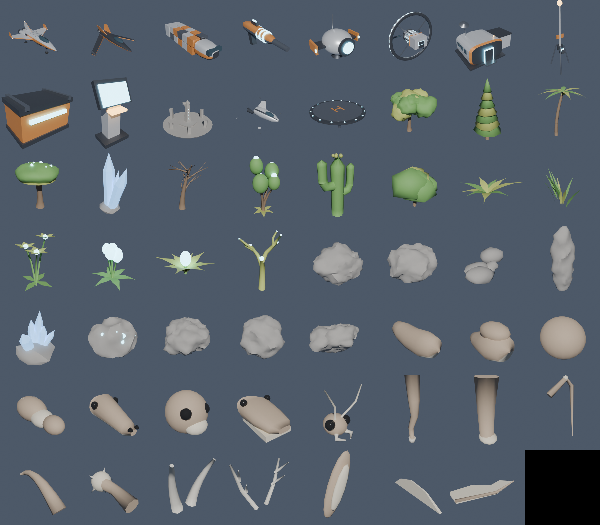

# Wayfarer

A space exploration game for PC, made with **Unity** and **Blender**, in the spirit of No Man's Sky. Wake up beside your ship on an alien world, gather resources to get it flying, and head off to explore a procedurally generated galaxy. You can fly seamlessly from a planet's surface into space, then jump from star to star.

Every star, planet, landscape, plant, animal and sound is generated from code. Blender builds the models from Python scripts and exports them to the Unity project.



## What's in it

- **A whole galaxy.** It's a spiral galaxy about 64,000 light-years across, generated sector by sector, with hundreds of stars within jump range at any time. Stars run from red dwarfs to blue giants, with realistic black-body colours. Each system has 2–6 planets, moons, sometimes a ringed gas giant, asteroid fields and a space station.
- **Seamless planets.** Planets have a radius of 18–30 km, and there's no loading screen between space and the ground. The terrain is a cube-sphere quadtree that gets more detailed as you approach, down to under a metre between vertices. Worker threads build it in the background so the frame rate stays smooth. Each planet has continents, mountain ranges, hills, beaches, oceans, snow lines, and depending on its type also dunes, terraces, craters or rock spires.
- **Ten kinds of world:** lush, ocean, desert, frozen, toxic, volcanic (with lava seas), barren, airless, anomalous and irradiated. Each has its own colours, sky, clouds, hazards, plants and wildlife.
- **Real atmospheres.** Rayleigh and Mie scattering is computed per pixel, so skies are blue (or green, or amber) at noon and turn red at sunset, and distant mountains fade into haze. From orbit you see a glowing rim, and night falls where the planet's shadow lands. Clouds drift with the wind and cast shadows on the ground. Oceans have waves, reflect the sky, glint in the sun and show shallows and surf near the shore. There are frozen seas and glowing lava seas too.
- **Day and night.** Planets spin, so the sun rises and sets and the stars wheel overhead. The night sky shows the band of the galaxy and the neighbouring stars from the galaxy map, in their true directions.
- **Life.** Plants and trees are scattered by climate: forests where it's wet, cacti where it's dry, fungi and crystal spires on stranger worlds. Animals are assembled from Blender-made bodies, heads, legs, tails, horns and wings, then scaled and coloured differently on every planet. They walk, graze, move in herds, flee, fly, and on hostile worlds they hunt you.
- **Survival.** You have life support, hazard protection (against heat, cold, toxins and radiation), a shield and health. Resources recharge them.
- **Your multi-tool** has a mining beam (with heat and charge), a blaster, an analysis visor for scanning and naming species, and a scanner pulse that finds resources and places.
- **Your starship.** Take off and land anywhere on dry land, fly through the atmosphere, boost, and use the pulse drive to cross a system in seconds. You can switch between chase and cockpit views, fire photon cannons, and repaint and rename the ship.
- **Space stations** where you dock, trade, buy upgrades, repair and refuel.
- **Hyperspace.** Craft warp cells and jump to any star in range on a 3D galaxy map. It shows your distance to the galactic core.
- **Danger.** Sentinel drones police some worlds and turn on you if you mine too greedily or kill wildlife. Pirates ambush you in open space.
- **Places to find.** Outposts, signal beacons, supply caches, crash sites, trading posts, and ancient monoliths with fragments of an older story.
- **Discoveries.** A log of every system, planet, species, plant, mineral and place you find, each worth units.
- **Guided start.** A short chain of goals teaches the basics, then leaves you to explore.
- **Procedural audio.** A generative ambient score, wind, engines, jetpack, mining beam and around 30 synthesised sound effects. There are no audio files.
- **HDR rendering.** Bloom, eye adaptation, filmic tone mapping, cascaded shadows, and four quality presets from Low to Ultra.
- **Autosave**, plus save and continue.

## Getting it running

You need **Unity 6 (6000.0 LTS)**. Unity 2022.3 LTS should also work. The project uses the Built-in Render Pipeline and only Unity's built-in modules, so there are no extra packages to install.

1. In **Unity Hub**, choose **Add → Add project from disk** and pick this `wayfarer` folder. If Hub asks about the editor version, choose the Unity 6 version you have installed.
2. Open the project. The first import takes a few minutes while Unity imports the models and compiles the shaders.
3. A setup script runs by itself. It creates `Assets/Scenes/Wayfarer.unity`, adds it to the build, switches to linear colour and checks that the classic Input Manager is enabled. If Unity then asks you to restart, do so. You can run it again at any time from **Wayfarer → Set Up Project**.
4. Press **Play**. The game builds everything at runtime, so the scene is intentionally empty. Pressing Play in any scene works.
5. To make a standalone game, choose **File → Build Profiles** (**Build Settings** in older versions), pick **Windows, Mac, Linux**, and click **Build**.

The **Wayfarer** menu in the editor can also delete or show your save, and rebuild the models with Blender.

## Controls

| On foot | |
| --- | --- |
| W A S D | Walk |
| Shift | Sprint |
| Space | Jump, hold for the jetpack, swim up |
| Mouse | Look |
| Left mouse | Mine, fire, or scan (in the visor) |
| Q | Switch between mining beam and blaster |
| F | Analysis visor |
| C | Scanner pulse |
| E | Interact, board your ship |
| T | Torch |

| Starship | |
| --- | --- |
| W / S | Throttle up / down |
| Mouse | Steer |
| A / D | Roll |
| Shift | Boost |
| Left mouse | Photon cannons |
| J | Pulse drive (in space) |
| E | Land (under 120 m), leave the ship, or dock (near a station) |
| Space | Take off |
| V | Cockpit / chase view |
| Mouse | Look around the ship while parked |

| Anywhere | |
| --- | --- |
| Tab or I | Inventory, technology and crafting |
| M | Galaxy map |
| L | Discoveries log |
| Esc | Pause, settings, save |

## Playing

### Your first hour

1. **Fuel the launch thrusters.** Press **C** to pulse the scanner, find the blue **hydrogen crystals** and hold the left mouse button to mine them. Then open the inventory (**Tab**) and recharge the Launch Thrusters.
2. **Take off.** Walk to your ship, press **E** to board and **Space** to launch. Fly up and out of the atmosphere.
3. **Visit the station.** Its marker is on screen. Press **J** to engage the pulse drive and cover the distance quickly, then press **E** near the station and the autopilot docks you. There you can sell what you've gathered, buy upgrades, and repair and refuel.
4. **Mine asteroids.** Shoot them with the photon cannons for **Helium-3**, which is pulse drive fuel.
5. **Build a warp cell.** Craft one in the inventory: 50 Hydrogen, 40 Helium-3 and 30 Ferrite.
6. **Jump.** Open the galaxy map (**M**), pick a star inside your range ring and engage the hyperdrive. You need to be flying, and out of the atmosphere.

After that, the galaxy is yours. The core is about 18,000 light-years away.

### Staying alive

- **Life support** drains while you're outside. Recharge it with **Oxygen** from red-leafed plants.
- **Hazard protection** drains on hostile worlds: faster in the heat of the day on hot planets and in the cold of night on frozen ones. Recharge it with **Sodium** from glowing yellow plants. Your ship and outposts shelter you.
- Your **shield** soaks up damage and recovers on its own. If life support or hazard protection runs out, your health goes next.
- If you die, you wake up by your ship and lose a tenth of your units. If your ship is destroyed, you're rebuilt at the station.

### Resources

| Resource | Where to find it | Used for |
| --- | --- | --- |
| Carbon | Any plant or tree | Mining beam charge, crafting |
| Ferrite | Rocks and boulders, asteroids | Warp cells, hull plating |
| Sodium | Glowing yellow plants | Hazard protection |
| Oxygen | Red-leafed plants | Life support |
| Hydrogen | Blue crystal clusters | Launch thrusters, warp cells |
| Helium-3 | Asteroids | Pulse drive, warp cells |
| Uranium | Deposits on volcanic and irradiated worlds | Launch thrusters |
| Copper, Silver, Gold, Platinum | Glowing ore deposits (which metal depends on the star's colour) | Upgrades, selling |

**Crafting:** Warp Cell, Hull Plating, Life Support Gel and Ion Battery.

**Upgrades** at stations cover life support, hazard shielding, the jetpack, suit and cargo slots, mining speed, blaster damage, hyperdrive range, ship shields, cannons and pulse efficiency.

### Sentinels and pirates

Planets show a sentinel level. On watchful and aggressive worlds, heavy mining, killing animals or attacking a patrol drone raises an alert. Drones then hunt you until you destroy them, outlast them, or fly away. In deep space, pirate fighters sometimes attack. Destroying them pays well.

## How it works

The game is built from code at runtime.

| Folder | What's in it |
| --- | --- |
| `Assets/Scripts/Core` | Double-precision vectors and rotations, seeded random numbers, simplex noise, name generation, settings, input, bootstrapping |
| `Assets/Scripts/Universe` | Galaxy sectors and stars (`Galaxy`), star systems (`SystemGen`), planet definitions (`PlanetData`), and the terrain and climate functions (`PlanetField`) |
| `Assets/Scripts/World` | The live system (`SystemView`): reference frames, floating origin, scaled space, lighting and sky. Also the terrain quadtree and worker threads (`PlanetTerrain`, `ChunkBuilder`, `TerrainJobs`), plants and rocks (`FloraSystem`), animals (`FaunaSystem`), places (`PoiSystem`), the star, gas giants, station and asteroids (`SpaceBodies`), and Blender model loading (`Models`) |
| `Assets/Scripts/Game` | The game loop (`Game`), on-foot controller, ship flight, camera, multi-tool, survival, combat, effects, items and inventory, missions, lore, saving |
| `Assets/Scripts/Rendering` | Material helpers, procedural meshes, HDR post-processing |
| `Assets/Scripts/Audio` | The synthesiser |
| `Assets/Scripts/UI` | HUD and menus (IMGUI) |
| `Assets/Scripts/Editor` | Project setup and FBX import settings |
| `Assets/Resources/Shaders` | Terrain, atmosphere/clouds/ocean, star, sky, foliage, props, gas giant, rings, effects and post-processing |
| `Assets/Resources/Models` | The FBX models exported from Blender |
| `Blender` | The Python scripts that build those models, a `.blend` file with all of them, and a preview sheet |

Some of the ideas that make a galaxy fit in Unity:

- **Floating origin and doubles.** All positions are 64-bit. Unity only sees coordinates relative to an origin that follows the camera, so there's no jitter even millions of kilometres out.
- **Rotating frames.** Near a planet, the game simulates in that planet's own spinning frame, so the ground holds still under you while the sun and stars move across the sky. Crossing into space converts your position, velocity and orientation exactly.
- **Scaled space.** Bodies more than 110 km away are drawn closer and proportionally smaller. They look identical, but stay inside the camera's depth range.
- **One terrain function.** `PlanetField` defines every planet's shape. Worker threads use it to build meshes, and the main thread uses it for walking, landing and placing things, so they always agree.
- **Atmosphere as a post-process.** A sphere drawn after the scene reads the depth buffer and ray-marches the air, clouds and sea for each pixel. It then blends the result over the scene as scattered light plus the scene times its transmittance.

Saves go to `wayfarer_save.json` in Unity's persistent data folder, and settings go to PlayerPrefs.

## Models: the Blender pipeline

The `Blender` folder builds all 55 models from Python with Blender's `bpy` API: ships, the station, the multi-tool, drones, buildings, 15 plants, rocks and deposits, asteroids and 18 creature parts. It exports each one as an FBX. The finished FBX files are already in `Assets/Resources/Models`, so you only need Blender to change them.

```sh
blender --background --python Blender/build_assets.py
# options (after a lone --):
#   --only ship_explorer,station   rebuild some models
#   --previews DIR                 render thumbnails and a contact sheet
#   --blend Blender/wayfarer_assets.blend   also save an editable .blend
```

You can also use **Wayfarer → Rebuild Models With Blender...** in the Unity editor. It needs Blender 4.2 or newer.

Things to know if you edit the models:

- Units are metres. Models face −Y with +Z up in Blender. The FBX export turns that into Unity's +Z forward and +Y up.
- **Material slot names matter.** The game swaps each imported material for its own by name: `Hull`, `HullAccent`, `HullDark`, `Metal`, `Glass`, `Glow`, `GlowAlt`, `Rubber`, `Bark`, `Leaf`, `Leaf2`, `Stone`, `Crystal`, `Skin`, `Skin2`, `Eye`, `Horn`. That's how one tree model gets a different colour on every planet.
- **Empties mark attachment points:** `Muzzle` on guns, `Cockpit` on the ship, `DockPoint` and `DockEntry` on the station, `Door` on outposts, and `Neck`, `Tail`, `Back` and `Leg*` on creature bodies (`Horn` and `Ear*` on heads).
- Plants and rocks have a `_LOD1` copy (decimated) that the game uses for distant instances.

## Tuning

- Planet shapes, colours, atmospheres and life: `Fill()` in `Assets/Scripts/Universe/SystemGen.cs`. The height function itself is in `PlanetField.Height()`.
- Star density and the start region: `Assets/Scripts/Universe/Galaxy.cs`.
- Graphics presets (view distances, terrain detail, shadows, atmosphere samples): `GraphicsQuality.Presets` in `Assets/Scripts/Core/Settings.cs`.
- Items, prices and recipes: `Assets/Scripts/Game/Items.cs`. Upgrades: `Profile.UpgradeDefs` in `Assets/Scripts/Game/Profile.cs`.
- Survival drain rates: `Assets/Scripts/Game/Survival.cs`. Ship speeds and the pulse drive: `ShipController.TickFlight()`.

## Credits

- The simplex noise in the shaders is by Ashima Arts and Stefan Gustavson (MIT licence). The C# simplex noise follows Stefan Gustavson's public-domain reference.
- The bloom filter follows the approach from *Call of Duty: Advanced Warfare* (Jorge Jimenez, SIGGRAPH 2014). The tone mapping uses Krzysztof Narkowicz's ACES fit.
